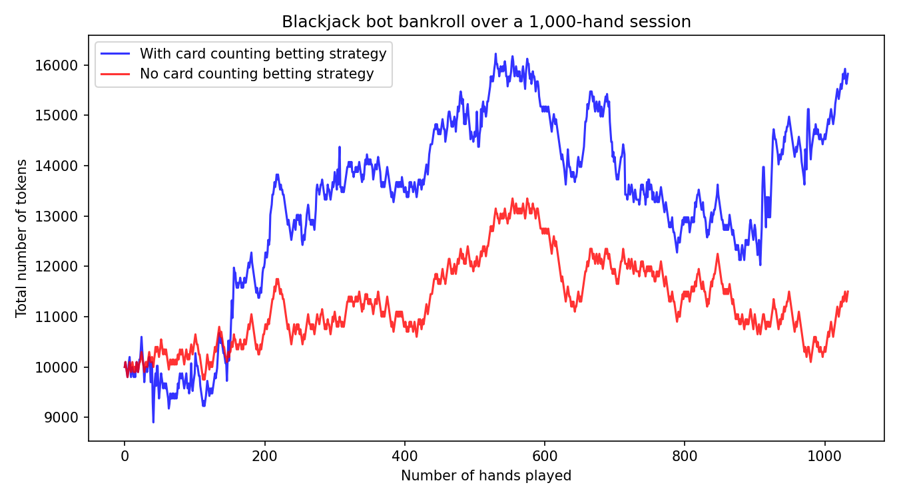

# Blackjack Algorithm using optimal strategy and Hi-Lo card counting

A Python simulation of a blackjack-playing bot that combines **optimal basic strategy** with **Hi-Lo card counting** to bias the odds in its favor, validated over **500,000+ simulated hands** to achieve an average return per hand of **+1.10%**.

This project was originally built as my [CS50P](https://cs50.harvard.edu/python/) graduation project.

## Overview

This project extracts optimal basic blackjack strategy from three different .csv files, and implements a card count strategy (Hi-Lo) to optimally adjust its betting amounts. The whole pipeline was validated through Monte Carlo simulations. 500 independent sessions of ~1,000 hands each were ran to measure its real expected return and risk of ruin.

## Features

- Full blackjack engine able to hit / stand / double / split, hit for the dealer until above 17, blackjack payouts (3:2), and shoe shuffling when less than 30 cards left in a total of 6 decks (312 cards total)
- **Optimal basic strategy** via lookup tables for hard hands, soft hands, and pairs
- **Hi-Lo card counting**, converting the running count into a true count used to size each bet
- Bet sizing is increased when the count is favorable to the player, and the amount available for betting is capped by the tokens actually available (starting with 10,000 tokens,and a betting unit of 100 tokens)
- A flat-betting baseline (no card counting) run alongside the counting strategy for direct comparison of strategy
- Large-scale simulation harness: 500 sessions × 1,000 hands, results logged to CSV per session

## How it works

1. **Shoe setup** : a 6-deck shoe is generated and reshuffled once fewer than 30 cards remain.
2. **Counting & betting** : each card dealt updates a running Hi-Lo count; a true count (running count ÷ decks remaining) determines the bet size for the next hand, within a min/max bet range.
3. **Strategy decision** : the player's hand (hard / soft / pair) is looked up against the dealer's up-card in one of three CSV strategy charts to decide hit / stand / double / split.
4. **Resolution** : the dealer plays out to 17+, the outcome is scored, and the bankroll is updated (bets are never allowed to exceed the tokens actually available).
5. **Repeat** : this runs for 1,000 hands per session, tracking bankroll, bets, and outcome counts throughout; a parallel "flat betting" bankroll (always betting the table minimum) is tracked for comparison.
6. **Batch simulation** : the whole process is repeated across a 500 independent sessions, each starting from a fresh 10,000-token bankroll, with summary statistics appended to a results CSV after every session.

## Results

Across 500 sessions (505,006 hands total, starting bankroll of 10,000 tokens per session and beting unit of 100 tokens):

| Metric | Card counting | Flat betting (no counting) |
|---|---|---|
| Average ending bankroll | 11,623 (+16.2%) | 9,263 (−7.4%) |
| Return per token wagered | **+1.10%** | −0.73% |
| Sessions busted to 0 tokens | 26 / 500 (5.2%) | 0 / 500 (0%) |

Overall: 224,465 wins, 236,772 losses, 43,769 pushes, 17,245 blackjacks.

Card counting converts blackjack's inherent (slightly negative) house edge into a small positive expected return once bet sizing follows the count. However it is a strategy which increases volatility: **5% of sessions went bust** even with a positive overall edge, which matters as much as the average return when judging whether the strategy is actually viable with a real bankroll. These results were achieved when the basic betting amount each round was 1% of the original starting amount. 

Bankroll progression for a single representative 1,000-hand session:



## Getting started

```bash
pip install -r requirements.txt

# Run the unit tests
pytest test_blackjack_simulation.py

# Run a single 1,000-hand session (prints results and shows the bankroll chart) or 500 games (saves results and key metrics to blackjack_bot_results.csv file)
python blackjack_bot.py

# Compute summary statistics over the batch results
python blackjack_bot_results.py
```

## Limitations & possible improvements

- Bet sizing uses fixed count thresholds rather than a bankroll-proportional approach
- Only the Hi-Lo counting system is implemented, not more complex card counting mechanisms. 
- No stop-loss or cash-out thresholds (i.e.sessions always run the full 1,000 hands unless the bankroll hits 0)
- Include more pytest functions to ensure the card counting, and token managment system function as intended

## Author

Aristide Fenaux
