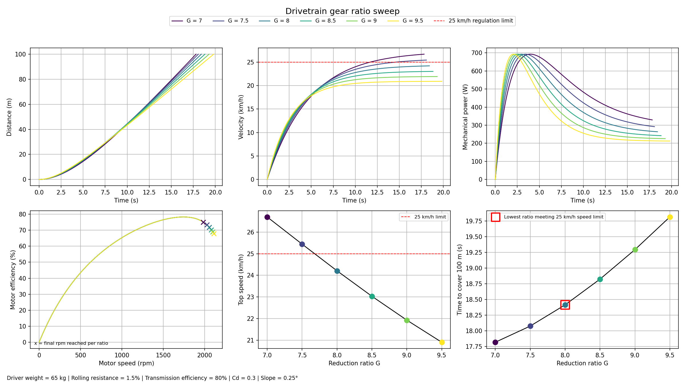

# Drivetrain Gear Ratio Simulation

A rapid physics simulation used to choose the optimal gear ratio for an electric vehicle's drivetrain. It models the car accelerating from rest and returns which of the **gear ratios** finishes a **fixed track distance fastest while staying under the competition's top-speed limit?**

## How it works

Simulates a straight-line run for several candidate gear ratios and compares them side by side. For each ratio it:

1. Steps the vehicle forward in time (0.001 s increments) from rest.
2. At every step, computes the force driving the car forward (from the motor, through the transmission, and to the wheel) and the forces resisting it (aerodynamic drag, rolling resistance, and a road slope).
3. Integrates the net force into acceleration, velocity, and distance travelled.
4. Stops once the car has covered the target track length, and records the finish time and top speed reached.

Once every ratio has been simulated, the script picks the **fastest ratio among those that stayed under the speed limit** and prints/highlights it.

## Physics model

- **Driving force**: The motor's torque-speed curve is a straight line (maximum torque at standstill, and decreasing linearly as motor rpm rises). That torque is multiplied by the gear ratio (at an assumed fixed transmission efficiency) to get wheel torque, then converted to a force at the tyre contact patch.
- **Resisting forces**: Aerodynamic drag using estimated of frontal area and coefficient of drag of the vehicle. Rolling Resistance estimated using tyre/road materials. Finally a Slope Resistance was added to simulate small bumps in the road. 
- **Motor electrical model**: a secondary calculation estimates the current and voltage the motor would need at each instant (using its torque constant and armature resistance), purely to derive an approximate motor efficiency curve. This does **not** feed back into the vehicle's motion, it is purely for a rough estimate of the motor's efficiency (see [Known limitations](#known-limitations)).
- **Integration**: Forward Euler for integration using small time step (0.001 s). 

## Results and Plots

Running the script opens and saves (as `drivetrain_sweep_results.png`) a 2×3 dashboard:

| Panel | Shows |
|---|---|
| Distance vs. time | Race progress for each gear ratio |
| Velocity vs. time | Speed profile per ratio, with the regulation speed limit marked |
| Mechanical power vs. time | Motor output power per ratio |
| Motor efficiency vs. motor rpm | Estimated efficiency curve, with an `x` marking the final rpm each ratio reaches |
| Top speed vs. gear ratio | How top speed falls off as the ratio increases |
| Time to finish vs. gear ratio | Finish time per ratio, with the **selected best ratio highlighted in red** |

Note that the optimal gear ratio  is a **live output of the script, not a fixed conclusion**. It updates automatically whenever the parameters at the top of the file are changed. Re-run the script after updating any vehicle or motor parameter to get a fresh answer.

## Known limitations

- The vehicle is modeled as a point mass, thus rotational inertia of the wheels and motor rotor is not accounted for. 
- Rolling resistance and transmission efficiency are treated as constants, while real value depend on speed
- The simulation assumes full throttle for the entire run and no wheel slipage.

## Author 

Aristide Fenaux