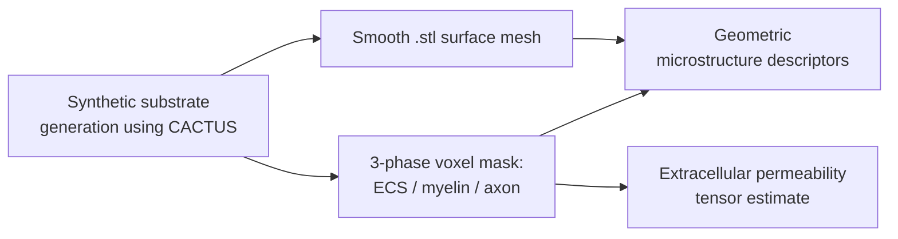

# Synthetic White-Matter Microstructure Generation & Extracellular Permeability Analysis Pipeline

## Overview
This project creates a computational pipeline for generating synthetic white-matter substrates and characterising their microstructural geometry and extracellular-space fluid transport properties.

White matter fibres can arrange themselves in vastly different ways to impact the geometric parameters which caracterizes them. The geometry of these fibres directly influence fluid transport through the **extracellular space (ECS)**. Better understanding fluid transport in the brain is key to improve targeted and non-invasive therapies. As such, the ultimate objective of this research effort is to directly infer fluid transport properties (permeability) from MRI-imaging and geometric parameter extraction. 

This specific project is an end-to-end computational pipeline that generates realistic synthetic axon substrates and, for each one, quantifies **(i)** a list of geometric microstructure descriptors and **(ii)** the full anisotropic permeability of the extracellular space. It was developed over several months as an Undergraduate Research Opportunity (UROP) project.

## Pipeline at a glance

## Pipeline Methodology

**1 : Substrate generation.** Fibre bundles are produced with a substrate generator (CACTUS) and passed into a custom pipeline to ensure maximum realism. The fibre centrelines are spline-smoothed to remove discretisation artefacts while preserving the underlying geometry.

**2 : Geometric reconstruction.** Each substrate is converted into a three-phase voxel mask (ECS, myelin, axon) and, in parallel, converted into a sub-voxel-smooth surface using a signed-distance-field approach, yielding an accurate fibre–ECS interface for further CDF fluid transport analysis.

**3 : Microstructure descriptors.** A number of geometric metrics are extracted from the three-phase voxel mask, such as density packing and orientation dispersion.

**4 : Permeability estimation.** The extracellular space is extracted as a pore network from the three-phase mask using PoreSpy library. Then the pore-network is fed into OpenPNM library to recover the full 3×3 permeability tensor, its principal permeabilities, and their orientations using a Stokes Flow solver.

A strong emphasis was placed on **numerical validation**: permeability resolution-convergence studies, representative-volume considerations, and cross-substrate physical-consistency checks. Clear technical documentation and reproducible research code were produced as final deliverables. 

## Availability & Intellectual Property

> This project is part of **ongoing research intended for peer-reviewed publication**. Accordingly, the **source code and quantitative results are not publicly available at this time.** All code, data, and results are the intellectual property of **[Imperial College London]** and its research group. All code and results will be publicly shared once official publication is complete. This repository provides solely a high-level overview of the work, further details can be discussed directly in an appropriate setting.

## Author

**Aristide Fenaux**, Supervised by **Dr. Tian Yuan**